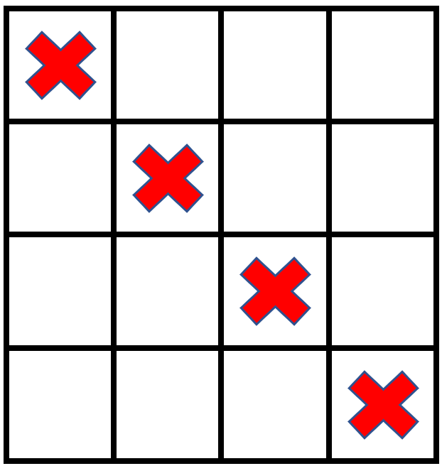

# 73. 矩阵置零

### Link



### Problem

给定一个 _`m`_` ``x`` `_`n`_ 的矩阵，如果一个元素为 **0** ，则将其所在行和列的所有元素都设为 **0** 。请使用 [**原地**](http://baike.baidu.com/item/%E5%8E%9F%E5%9C%B0%E7%AE%97%E6%B3%95) 算法**。**

示例 1：

<figure><figcaption></figcaption></figure>


```
输入：matrix = [[1,1,1],[1,0,1],[1,1,1]]
输出：[[1,0,1],[0,0,0],[1,0,1]]
```


示例2：

<figure><figcaption></figcaption></figure>


```
输入：matrix = [[0,1,2,0],[3,4,5,2],[1,3,1,5]]
输出：[[0,0,0,0],[0,4,5,0],[0,3,1,0]]
```


提示：

* m == matrix.length&#x20;
* n == matrix\[0].length&#x20;
* 1 <= m, n <= 200&#x20;
* \-231 <= matrix\[i]\[j] <= 231 - 1 &#x20;

进阶：

* 一个直观的解决方案是使用  O(mn) 的额外空间，但这并不是一个好的解决方案。&#x20;
* 一个简单的改进方案是使用 O(m + n) 的额外空间，但这仍然不是最好的解决方案。&#x20;
* 你能想出一个仅使用常量空间的解决方案吗？

### Solution



```python
class Solution:
    def setZeroes(self, matrix: List[List[int]]) -> None:
        """
        Do not return anything, modify matrix in-place instead.
        """
        m, n = len(matrix), len(matrix[0])
        flag = False

        for i in range(0, m):
            if matrix[i][0] == 0 :
                flag = True
            for j in range(1, n) :
                if matrix[i][j] == 0 :
                    matrix[i][0] = matrix[0][j] = 0

        for i in range(m-1, -1, -1):
            for j in range(1, n) :
                if matrix[i][0] == 0 or matrix[0][j] == 0 :
                    matrix[i][j] = 0
            if flag :
                matrix[i][0] = 0
```



<pre class="language-cpp"><code class="lang-cpp"><strong></strong></code></pre>



```go
```


